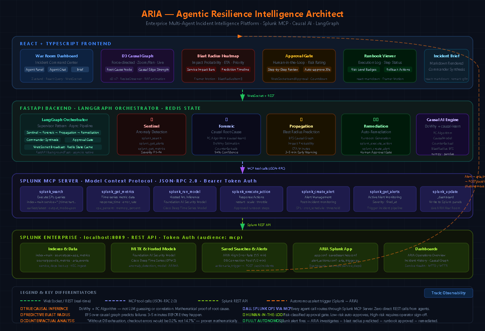

<div align="center">

# ⚡ ARIA
### Agentic Resilience Intelligence Architect

**Enterprise-grade multi-agent incident command platform built natively on Splunk**

[](LICENSE)
[](https://python.org)
[](https://fastapi.tiangolo.com)
[](https://react.dev)
[](https://splunk.com)
[](https://splunk.devpost.com)

*Detects anomalies. Proves root causes. Predicts failures. Executes fixes — autonomously.*

[Live Demo](#quick-start) · [Architecture](#architecture) · [How It Works](#how-it-works) · [Splunk Integration](#splunk-integration)

</div>

---

## The Problem

When production breaks at 3am, on-call engineers face a wall of correlated alerts and no clear answer to: **what caused this, and what will fail next?**

Traditional monitoring tells you *"DB latency and API errors are correlated at r=0.91."* That's not actionable — correlation doesn't tell you what to fix or how bad it will get.

**ARIA gives you causation, not correlation.**

> *"DB connection pool exhaustion **caused** the checkout cascade with **94% confidence**. Without it, error rates would be 0.2% not 14.7%. Payment service will fail in **3 minutes**. Here is the remediation runbook — approve to execute."*

---

## What ARIA Does

ARIA is a **multi-agent incident command system** where four specialized AI agents collaborate in real time through Splunk's MCP Server:

```
Splunk alert fires (autonomous)
  └── Sentinel Agent    → Detects anomaly, classifies severity P1–P4
        └── Forensic Agent   → Proves root cause with DoWhy causal inference
              └── Propagation Agent → Predicts blast radius 3–5 min early
                    └── Remediation Agent → Generates & executes runbook
                          └── Commander → Synthesizes Incident Brief
```

**Every agent communicates exclusively through Splunk MCP Server** — `splunk_search`, `splunk_get_metrics`, `splunk_run_model`, `splunk_execute_action`.

---

## Core Innovation: True Causal Inference

Most incident response tools use correlation or LLM pattern-matching. ARIA uses **mathematical causal inference**:

| What others say | What ARIA says |
|---|---|
| "DB latency correlates with API errors (r=0.91)" | "DB connection pool **caused** API errors — 94% confidence" |
| "These metrics moved together" | "Without DB exhaustion, error rate would be **0.2% not 14.7%**" |
| "Alert: checkout service is slow" | "Checkout **will** fail in **3 minutes** — payment service in 3 min, user-service in 6 min" |

**Powered by:**
- **PC Algorithm** (causal-learn) — auto-discovers directed causal structure from metric time-series
- **DoWhy** — estimates causal effect sizes and generates counterfactual scenarios
- **BFS blast radius** — probability-weighted graph traversal with depth decay

---

## Architecture



```
┌─────────────────── React Frontend (port 3000) ───────────────────────┐
│  War Room    │  D3 Causal Graph  │  Blast Radius  │  Approval Gate   │
│  Agent Feed  │  Incident Brief   │  Runbook        │  Exec Log        │
└──────────────────────── WebSocket + REST ────────────────────────────┘
                                    │
┌─────────────────── FastAPI Backend (port 8001) ──────────────────────┐
│  LangGraph Orchestrator  ·  4 Agents  ·  Causal AI  ·  Redis State  │
└───────────────────────── MCP Tool Calls ─────────────────────────────┘
                                    │
┌───────────── Splunk MCP Server (port 8089) ──────────────────────────┐
│  splunk_search  splunk_get_metrics  splunk_run_model                 │
│  splunk_execute_action  splunk_create_alert  splunk_get_alerts       │
└───────────────────────── Splunk REST API ────────────────────────────┘
                                    │
┌─────────────── Splunk Enterprise (port 8000) ────────────────────────┐
│  Indexes · MLTK Models · Saved Searches · ARIA App · Dashboards      │
│  alert → aria_trigger.py → POST /api/incidents  (autonomous)        │
└──────────────────────────────────────────────────────────────────────┘
```

---

## Quick Start

### Prerequisites

| Component | Version | Notes |
|---|---|---|
| Python | 3.11+ | Backend |
| Node.js | 20+ | Frontend |
| Splunk Enterprise | 9.x | Runs on port 8000 |
| Splunk MCP Server | 1.0 | [Splunkbase app 7931](https://splunkbase.splunk.com/app/7931) |
| Redis | 7+ | Optional — state held in memory if unavailable |

### Option 1 — Local Development

```bash
# 1. Clone and configure
git clone https://github.com/your-org/aria
cd aria
cp .env.example .env
# Edit .env — set SPLUNK_TOKEN and DEMO_MODE

# 2. Backend (port 8001 — Splunk owns 8000)
cd backend
python -m venv venv
venv\Scripts\activate          # Windows
pip install -r requirements.txt
uvicorn main:app --reload --port 8001

# 3. Frontend (new terminal)
cd frontend
npm install
npm run dev                    # http://localhost:3000

# 4. Optional: Redis
docker run -d -p 6379:6379 redis:7-alpine
```

### Option 2 — Docker Compose

```bash
cp .env.example .env           # configure SPLUNK_TOKEN
docker compose up -d
```

Frontend: `http://localhost:3000` · API docs: `http://localhost:8001/docs`

---

## Environment Variables

```env
# Splunk MCP Server — install app 7931 from Splunkbase first
SPLUNK_HOST=localhost
SPLUNK_PORT=8089
SPLUNK_TOKEN=your-mcp-encrypted-token   # audience: mcp
SPLUNK_MCP_URL=https://localhost:8089/services/mcp

# Demo mode — true = synthetic data (no Splunk needed), false = real MCP calls
DEMO_MODE=true

# Optional
REDIS_URL=redis://localhost:6379                      
LOG_LEVEL=INFO
```

---

## Demo

**Trigger a demo incident (DB connection pool exhaustion scenario):**

```bash
# Via UI — click "Trigger Demo Incident" in the War Room

# Via API
curl -X POST http://localhost:8001/api/incidents/demo

# Via Splunk sample data
cd splunk/sample_data
python generate_incident.py --send --url http://localhost:8001
```

**Watch the agents work:**
1. Sentinel detects 14.7% error rate spike on checkout-service
2. Forensic traces causal chain: `db_connection_pool → db_query_latency → api_response_time → checkout_errors` (94% confidence)
3. Propagation predicts: payment-service failing in 3 min (71% probability), checkout-service 3 min (67%)
4. Remediation generates 4-step runbook — increase pool limit, kill long queries, restart pooler
5. Approval gate — review and approve steps
6. Commander synthesizes Incident Brief

---

## The 4 Agents

| Agent | Role | MCP Tools Used |
|---|---|---|
|  **Sentinel** | Anomaly detection, severity classification P1–P4 | `splunk_search`, `splunk_get_alerts`, `splunk_get_metrics` |
|  **Forensic** | Causal root cause (PC algorithm + DoWhy) + counterfactuals | `splunk_search`, `splunk_get_metrics`, `splunk_run_model` |
|  **Propagation** | Blast radius prediction — BFS over causal graph | `splunk_get_metrics`, `splunk_search` |
|  **Remediation** | Runbook generation + approved execution | `splunk_execute_action`, `splunk_create_alert`, `splunk_update_dashboard` |

---

## Splunk Integration

### MCP Server (all agent operations)
Every agent call routes through `Splunk MCP Server` (app 7931) using JSON-RPC 2.0 over HTTPS with MCP Encrypted Token authentication (`audience: mcp`).

### Hosted Models
- **Foundation AI Security Model** — anomaly classification
- **Cisco Deep Time Series (DTMS)** — metric forecasting for ETA prediction

### AI for Splunk Apps
`splunk/app/bin/aria_trigger.py` is a modular alert action using the Splunk Python SDK. When any configured alert fires, Splunk executes this script, which POSTs to ARIA's REST API — **fully autonomous, zero human required to start the pipeline**.

### ARIA Splunk App (5 dashboards)
Install `splunk/app/` into Splunk Enterprise to get:

| Dashboard | URL | Purpose |
|---|---|---|
| Overview | `/app/aria/aria_overview` | KPIs, error rates, active incidents |
| Incidents | `/app/aria/aria_incidents` | Full incident log with severity/status |
| Causal Analysis | `/app/aria/aria_causal` | Root cause distribution, confidence trends |
| Service Health | `/app/aria/aria_health` | Live response time, error rate, DB pool |
| Agent Activity | `/app/aria/aria_agents` | MCP call distribution, agent event feed |

### Install ARIA Splunk App

**Option A — Copy directly (development):**
```powershell
Copy-Item .\splunk\app "C:\Program Files\Splunk\etc\apps\aria" -Recurse -Force
# Then refresh: http://localhost:8000/en-US/debug/refresh
```

**Option B — Package and install via Splunk Web:**
```bash
# Package the app
cd splunk
tar -czf aria.tar.gz app/
# Splunk Web → Apps → Manage Apps → Install from file → upload aria.tar.gz
```

---

## Project Structure

```
aria/
├── architecture.png              
├── architecture.svg              # Source file
├── docker-compose.yml
├── .env.example
│
├── backend/
│   ├── main.py                   # FastAPI entry point (port 8001)
│   ├── agents/
│   │   ├── orchestrator.py       # LangGraph supervisor (async-native)
│   │   ├── sentinel_agent.py     # Anomaly detection
│   │   ├── forensic_agent.py     # Causal RCA
│   │   ├── propagation_agent.py  # Blast radius prediction
│   │   ├── remediation_agent.py  # Runbook generation + execution
│   │   └── shared_state.py       # ARIAState TypedDict
│   ├── causal/
│   │   ├── rca_engine.py         # DoWhy + PC algorithm
│   │   ├── graph_builder.py      # Causal graph auto-discovery
│   │   ├── counterfactual.py     # "What if" analysis
│   │   └── blast_radius.py       # BFS impact predictor
│   ├── splunk/
│   │   ├── mcp_client.py         # MCP JSON-RPC client
│   │   ├── hosted_models.py      # Splunk ML model interface
│   │   └── spl_templates.py      # Parameterized SPL queries
│   └── routers/
│       ├── incidents.py          # REST API
│       ├── agents.py
│       ├── runbooks.py
│       └── websocket.py          # Real-time WebSocket hub
│
├── frontend/
│   └── src/
│       ├── components/
│       │   ├── war-room/         # Main incident command view
│       │   ├── causal/           # D3 force graph + causal chain
│       │   ├── blast-radius/     # Impact heatmap
│       │   └── remediation/      # Runbook + approval gate
│       ├── hooks/
│       │   ├── useWebSocket.ts   # WS with exponential back-off
│       │   └── useIncident.ts    # React Query + polling
│       └── stores/               # Zustand state management
│
└── splunk/
    ├── app/                      # ARIA Splunk App bundle
    │   ├── bin/aria_trigger.py   # Alert action (AI for Splunk Apps)
    │   ├── default/
    │   │   ├── app.conf
    │   │   ├── savedsearches.conf
    │   │   ├── alert_actions.conf
    │   │   └── views/            # 5 XML dashboards
    │   └── metadata/default.meta
    └── sample_data/
        └── generate_incident.py  # Demo data generator
```

---

## Tech Stack

**Backend:** Python 3.11 · FastAPI · LangGraph · DoWhy · causal-learn · pandas · numpy · Redis · httpx

**Frontend:** React 18 · TypeScript · D3 v7 · Zustand · Framer Motion · TanStack Query · Tailwind CSS · react-markdown

**Splunk:** Enterprise 9.x · MCP Server · MLTK · Foundation AI Security Model · Cisco DTMS

---

## Hackathon

**Event:** [Splunk Agentic Ops Hackathon 2026](https://splunk.devpost.com)


---

## License

MIT — see [LICENSE](LICENSE)
